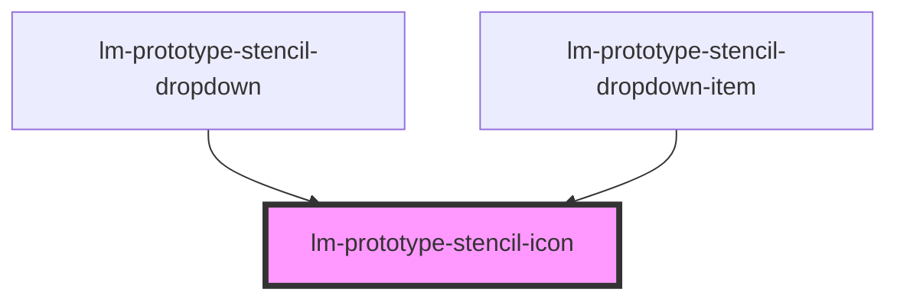

# lm-prototype-stencil-icon

<!-- Auto Generated Below -->

## Properties

| Property            | Attribute | Description | Type                                                            | Default     |
| ------------------- | --------- | ----------- | --------------------------------------------------------------- | ----------- |
| `label`             | `label`   |             | `string \| undefined`                                           | `undefined` |
| `name` _(required)_ | `name`    |             | `"arrow-right" \| "check" \| "chevron-down" \| "loader" \| "x"` | `undefined` |

## Dependencies

### Used by

 - [lm-prototype-stencil-dropdown](../lm-protoype-stencil-dropdown)
 - [lm-prototype-stencil-dropdown-item](../lm-protoype-stencil-dropdown)

### Graph

----------------------------------------------

*Built with [StencilJS](https://stenciljs.com/)*
