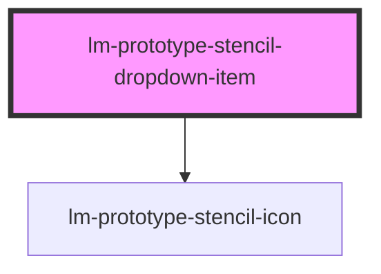

# lm-prototype-stencil-dropdown-item

<!-- Auto Generated Below -->

## Properties

| Property  | Attribute  | Description | Type                                                                         | Default     |
| --------- | ---------- | ----------- | ---------------------------------------------------------------------------- | ----------- |
| `icon`    | `icon`     |             | `"arrow-right" \| "check" \| "chevron-down" \| "loader" \| "x" \| undefined` | `undefined` |
| `iconEnd` | `icon-end` |             | `"arrow-right" \| "check" \| "chevron-down" \| "loader" \| "x" \| undefined` | `undefined` |
| `value`   | `value`    |             | `string`                                                                     | `''`        |

## Events

| Event                     | Description | Type                |
| ------------------------- | ----------- | ------------------- |
| `lm-dropdown-item-select` |             | `CustomEvent<void>` |

## Dependencies

### Depends on

- [lm-prototype-stencil-icon](../lm-prototype-stencil-icon)

### Graph

----------------------------------------------

*Built with [StencilJS](https://stenciljs.com/)*
